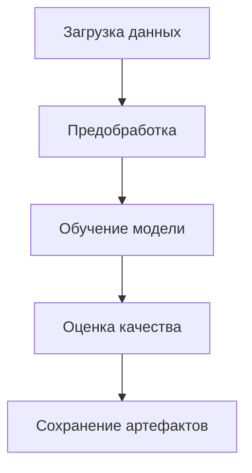

### **Автоматизированный ML-пайплайн с Airflow**  

Этот проект представляет собой **готовый шаблон** для построения **сквозного пайплайна машинного обучения** с использованием **Apache Airflow**. Он охватывает все этапы — от загрузки данных до развертывания модели, обеспечивая **гибкость, воспроизводимость и масштабируемость**.  
### **Этап 1. Планирование ML-пайплайна для диагностики рака груди**  

#### **🔍 Анализ датасета**  
Датасет `wdbc.data` содержит **569 образцов** с **30 признаками**, описывающими характеристики опухолей молочной железы:  
- **Целевая переменная**: `diagnosis` (M = злокачественная, B = доброкачественная)  
- **Признаки**:  
  - Размер (`radius`), текстура (`texture`), форма (`perimeter`, `area`)  
  - Статистики (среднее, стандартное отклонение, "наихудшее" значение)  

**Задача**: **Бинарная классификация** (предсказание типа опухоли).  

---

#### **📌 Структура пайплайна**  
Пайплайн состоит из **5 ключевых этапов**:  

1. **Загрузка данных**  
   - Чтение CSV-файла  
   - Проверка на пропуски и дубликаты  

2. **Предобработка**  
   - Кодировка целевой переменной (`M` → `1`, `B` → `0`)  
   - Нормализация числовых признаков (`StandardScaler`)  
   - Разделение на train/test (80/20)  

3. **Обучение модели**  
   - Выбор алгоритма: **Logistic Regression** (базовый вариант)  
   - Кросс-валидация (K-Fold, `k=5`)  
   - Подбор гиперпараметров (`GridSearchCV`)  

4. **Оценка качества**  
   - Метрики: **Accuracy, Precision, Recall, F1-score**  
   - Построение **ROC-кривой** и **матрицы ошибок**  

5. **Сохранение артефактов**  
   - Экспорт модели (`pickle`)  
   - Логирование метрик (`MLflow`)  

---

#### **🔗 Схема пайплайна**  


**Пояснение**:  
- **Стрелки** обозначают последовательность этапов.  
- Каждый этап **зависит от результатов предыдущего**.  

---

#### **📄 Псевдокод DAG для Airflow**  
```python
from airflow import DAG
from airflow.operators.python import PythonOperator

dag = DAG(
    "cancer_classification",
    schedule_interval="@weekly",
)

load_data = PythonOperator(task_id="load_data", python_callable=load_raw_data)
preprocess = PythonOperator(task_id="preprocess", python_callable=clean_and_normalize)
train_model = PythonOperator(task_id="train_model", python_callable=train_ml_model)
evaluate = PythonOperator(task_id="evaluate", python_callable=run_metrics)
save_results = PythonOperator(task_id="save_results", python_callable=export_artifacts)

load_data >> preprocess >> train_model >> evaluate >> save_results
```

---

#### **📊 Пример метрик (ожидаемый результат)**  
| Метрика       | Значение |
|---------------|----------|
| Accuracy      | 0.98     |
| Precision (M) | 0.97     |
| Recall (M)    | 0.96     |
| F1-score      | 0.97     |
