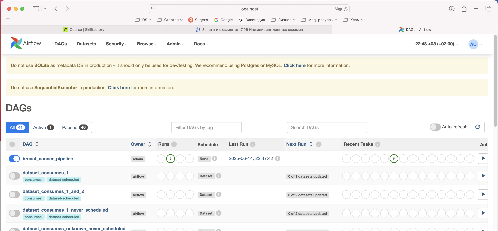
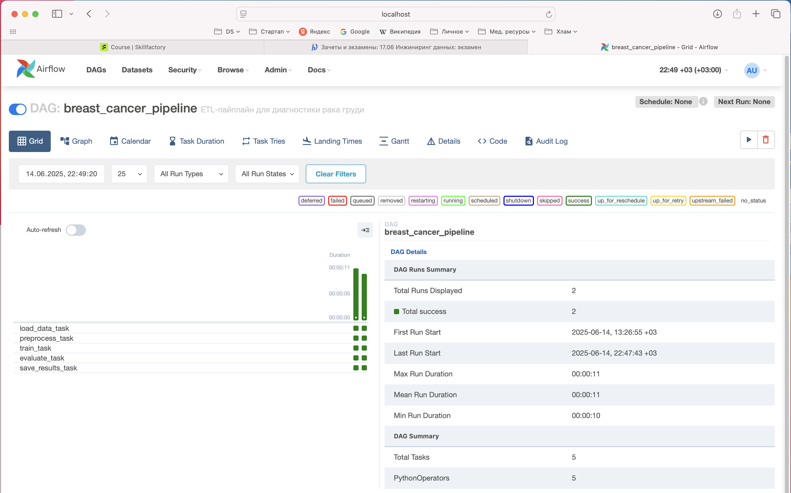

# Автоматизация и оркестрация пайплайна машинного обучения с использованием Apache Airflow и облачного хранилища.

## Описание задания
Вы инженер данных в медицинском центре, где разрабатываются предиктивные модели диагностики заболеваний. Ваша задача — спроектировать и реализовать автоматизированный ETL-процесс: от получения медицинских данных до выгрузки результатов модели в облачное хранилище с помощью Apache Airflow и Python. 

Результат работы: воспроизводимый проект в виде репозитория с пояснениями в формате README.

## Описание данных
Датасет: Breast Cancer Wisconsin Diagnostic (в формате CSV). Загрузите его из [источника](https://archive.ics.uci.edu/ml/machine-learning-databases/breast-cancer-wisconsin/wdbc.data).

## Структура файлов и папок репозитория:

- `dags/`  
  - *pipeline_dag.py* - DAG-файл для Airflow
- `data/` - данные для модели:
  - *data.csv* - сохраненный исходный загруженный датасет
  - *processed_data_train.csv* - сохраненный предобработанный train-датасет 
  - *processed_data_train.csv* - сохраненный предобработанный test-датасет
  - *wdbc.data* - исходный датасет для локальной загрузки
- `etl/` — модульные Python-скрипты для шагов пайплайна:
  - *load_data.py* - загрузка исходных данных (датасет Breast Cancer Wisconsin Diagnostic) и сохранение в файл .csv
  - *preprocess.py* - предобработка данных, разделение датасета на train/test, сохранение подвыборок
  - *train_model.py* - обучение модели на train-датасете, сохранение обученной модели
  - *evaluate.py* - оценка модели на test-датасете, сохранение метрик
  - *save_results.py* - сохранение результатов работы пайплайна в папку `results/`: обученная модель (.pkl), метрики (.json)
- `results/` — финальные метрики и обученная модель
- `logs/` — лог-файлы
- *README.md* — документация проекта 
- *project.yml* - окружение *conda* для воспроизводимости
  - или установите библиотеки : *numpy*, *pandas*,  *scikit-learn*, *airflow*, *pendulum*

## Обзор проекта
Этот **проект** реализует автоматизированный ETL-пайплайн (Extract, Transform, Load) для создания предиктивной модели диагностики рака груди на основе датасета Breast Cancer Wisconsin Diagnostic. Пайплайн оркестрируется с использованием Apache Airflow, а результаты сохраняются на локальный диск.     

## Задача машинного обучения
- **Проблема**: Бинарная классификация для предсказания диагноза опухоли (злокачественная или доброкачественная).
- **Датасет**: Breast Cancer Wisconsin Diagnostic, загружаемый из [UCI Machine Learning Repository](https://archive.ics.uci.edu/ml/datasets/Breast+Cancer+Wisconsin+%28Diagnostic%29).
- **Модель**: Логистическая регрессия.
- **Метрики**: Accuracy, Precision, Recall, F1-Score.     

**Примечание:** так как оцениваются прежде всего навыки инжиниринга данных, то с целью ускорения процессов модель обучается без подбора гиперпараметров и EDA.

## Структура пайплайна
Пайплайн состоит из следующих этапов:
1. **Загрузка данных**: Загрузка CSV-датасета.
2. **Предобработка**: Обработка пропущенных значений, нормализация признаков, кодирование меток, разделение данных на train/test.
3. **Обучение модели**: Обучение модели логистической регрессии.
4. **Оценка**: Расчет и сохранение метрик на отложенной тестовой выборке.
5. **Сохранение результатов**: Сохранение обученной модели и метрик в локальную папку `results/`.

### Схема пайплайна
```
[Загрузка данных] -> [Предобработка данных] -> [Обучение модели] -> [Оценка модели] -> [Сохранение результатов]
```

### Компоненты ETL (папка etl/)
- **`load_data.py`**: Загружает датасет из репозитория UCI и сохраняет его в pandas DataFrame.
- **`preprocess.py`**: Очищает данные (обрабатывает пропущенные значения, нормализует признаки, кодирует метки).
- **`train_model.py`**: Обучает модель логистической регрессии и сохраняет её.
- **`evaluate.py`**: Вычисляет метрики классификации (Accuracy, Precision, Recall, F1).
- **`save_results.py`**: Сохраняет модель (в формате pickle) и метрики (в формате JSON) в папку `results/`.

Каждый скрипт модульный, принимает аргументы командной строки для путей ввода/вывода и может запускаться независимо или через Airflow.


## Инструкция по локальному запуску
- клонируйте репозиторий
- зайдите в корневую папку репозитория и запустите из нее терминал
- установите и активируйте окружение *conda*:
  - `conda env create -f project.yml`
  - `conda activate project`
- последовательно запустите скрипты:
  - `python etl/load_data.py`
  - `python etl/preprocess.py`
  - `python etl/train_model.py`
  - `python etl/evaluate.py`
  - `python etl/save_results.py`
- в результате работы в папке `results/` появятся метрики и обученная модель
- **Примечание:** папки для загрузки и сохранения файлов могут быть указаны вручную через аргументы строки (см. скрипты)

## Инструкция по запуску в AirFlow (MacOS)
- клонируйте репозиторий
- зайдите в корневую папку репозитория и запустите из нее терминал
- установите и активируйте окружение *conda*:
  - `conda env create -f project.yml`
  - `conda activate project`
- установите переменную окружения *AIRFLOW_HOME*, чтобы указать, где будут храниться конфигурации, логи и база данных Airflow:
  - `export AIRFLOW_HOME=~/airflow`
- инициализируйте базу данных Airflow  для локального тестирования:
  - `airflow db init`
- создайте пользователя для доступа к веб-интерфейсу Airflow (пример ниже):
  ```
  airflow users create \
    --username admin \
    --firstname Admin \
    --lastname User \
    --role Admin \
    --email admin@example.com \
    --password admin
  ```
- зайдите в появившуюся папку `~/airflow`: 
  - обновите файл конфигурации `~/airflow/airflow.cfg`, чтобы логи Airflow сохранялись в папку проекта:
    - найдите строку *base_log_folder* и установите:       
    `base_log_folder = /path/to/logs`    
    замените */path/to/logs* на **абсолютный (!)** путь логам, например в папке проекта  
  - в папку `dags` (создайте, если ее нет) переместите файл `dags/pipeline_dag.py` из клонированного репозитория
  - отредактируйте данный dag-файл, указав **абсолютный (!)** путь к папке проекта и папке для сохранения результатов, не забыв про `/`в конце пути
- для локальной загрузки датасета в папке `data/` клонированного репозитория должен быть файл *wdbc.data*
- в отдельном терминале (если надо повторно активируйте окружение) запустите планировщик *Airflow* (оставьте его работать в фоновом режиме):
  - `airflow scheduler`
- в другом терминале запустите веб-интерфейс *Airflow*:
  - `airflow webserver --port 8080`
- откройте браузер и перейдите по адресу `http://localhost:8080`. Войдите, используя логин *admin* и пароль *admin* (либо свои данные, если их вводили при настройке выше).
- в веб-интерфейсе *Airflow* найдите *DAG* с именем **breast_cancer_pipeline**
- запустите вручную
- проверьте, что в папке с результатми работы пайплайна появились обученные модель и метрики

### Скриншоты работы пайплайна через AirFlow



## Хранение результатов
- **Место хранения**: Локальный диск (папка `results/`).
- **Сохраняемые артефакты**:
  - `model.pkl`: Обученная модель логистической регрессии.
  - `metrics.json`: Метрики производительности (Accuracy, Precision, Recall, F1).
- **Логика**: Скрипт `save_results.py` сохраняет модель и метрики в указанную папку `results/`. 
- **Формат**:
  - Модель: Файл pickle (`.pkl`).
  - Метрики: Файл JSON (`.json`).

### Пример JSON-файла метрик
```json
{
  "accuracy": 0.95,
  "precision": 0.93,
  "recall": 0.94,
  "f1": 0.935
}
```

## Анализ отказов и улучшения
- **Потенциальные сбои**:
  - **Загрузка данных**: Проблемы с сетью при загрузке датасета. Столкнулся с невозможностью напрямую загрузить исходный датасет через AirFlow из-за конфликта пакетов (локально все работает) **Решение**: Реализовал через DAG использование локальной копии.
  - **Предобработка**: Пропущенные или некорректные данные. **Решение**: Добавить проверки валидности данных.
  - **Обучение модели**: В данном случае качество модели хорошее, однако потенциально можно иметь проблемы сходимости логистической регрессии. **Решение**: Настроить гиперпараметры или использовать другой алгоритм.
  - **Хранение**: Недостаток места на диске. **Решение**: Проверять доступное место перед сохранением.
- **Улучшения**:
  - Реализовать настройку гиперпараметров с помощью GridSearchCV, Optuna.
  - Расширить до облачного хранилища (например, AWS S3) для масштабируемости.
  - Добавить мониторинг и уведомления о сбоях пайплайна.